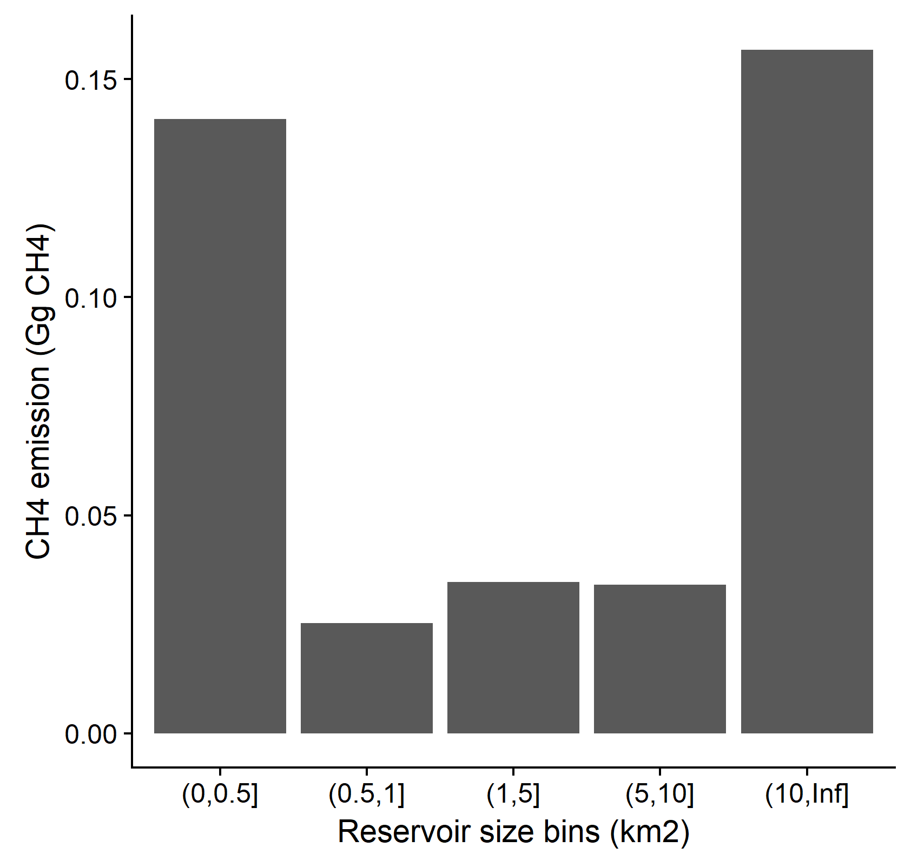

```{r echo=FALSE, eval = FALSE}
# this .rmd relies on data objects created in 'scripts/readSpatial.R' and therefore cannot be knit (knitting creates a new local environment that cannot access objects in the global environment).  To generate a .html from this .rmd, use rmarkdown::render().  Also, need to run scripts/masterLibrary.R and scripts/readSpatial.R first.
```


# Background
The USEPA Office of Air and Radiation has requested that methane (CH4) and carbon dioxide (CO2) emissions from reservoirs be included in the *Inventory of U.S. Greenhouse Gas Emissions and Sinks*.  The Intergovernmental Panel on Climate Change (IPCC) has issued guidance for estimating these emissions, but the model used to derive the IPCC emission factors was trained with a global data set which included very few measurements from the US.  It is therefore uncertain how accurate the IPCC emission factors are for US reservoirs.  Methane emission rates vary by to three orders of magnitude across US reservoirs, therefore a small bias in IPCC emission factors could strongly bias the inventory estimate.
To address this problem, the Office of Research and Development established the SuRGE project (Survey of Reservoir Greenhouse gas Emissions), a three-year survey of CH4 and CO2 emission rates froem US reservoirs.  SuRGE will be a collaborative effort involving several ORD locations, EPA Regional Biologists, the USGS, and other collaborators.  The effort is supported under the FY 19-22 AE StRAP:

**Topic 2**: Science for Air Quality Decisions

**Research Area 2**: Approaches for characterizing source emissions, air quality, exposure, and mitigation strategies

**Output**: AE.04 Methods for Estimating Methane Emissions from Surface Water Reservoirs for the U.S. GHG Inventory Report
“*National-scale survey of methane emissions from reservoirs in the United States to reduce uncertainty in inventory estimates*" by improving the characterization of previously under-reported biogenic methane emissions and how water level changes, nutrient content, and ambient conditions may affect the timing and rate of emissions; this research will address a key gap in monitoring data for the Greenhouse Gas Emissions Inventory United Nations Framework Convention on Climate Change (UNFCCC) reporting requirements”

# Upscaling approaches
## Rationale
To maximize flexibility in upscaling approaches, the survey design should allow for upscaling to the population of US reservoirs via classical survey statistics and/or via statistical modeling.  Both approaches require knowledge of the population of US reservoirs, which is difficult to achieve because a definitive list of US reservoirs does not exist.

## Survey design approach
Upscaling via a classical survey design approach requires sample sites that represent a probabilistic subset of the population of US reservoirs.  Since a definitive list of US reservoirs does not exist, we will build on knowledge of US reservoirs from previous EPA surveys.  In 2017 the USEPA executed a probabilistic survey of ~1200 US waterbodies during the National Lakes Assessment (NLA17).  522 of the waterbodies are ‘man-made’ and represent a probabilistic subsample of the population of US man-made waterbodies.  A probabilistic subsample of these man-made waterbodies will therefore allow for inference to the population of US man-made waterbodies.  

```{r echo=FALSE, warning=FALSE, message=FALSE, fig.cap="Figure 1.  Man-made sites sampled in NLA 2017"}
# Get states map
states <- us_states() %>%
  dplyr::filter(!name %in% c('Alaska','Hawaii', 'Puerto Rico')) %>% # CONUS
  st_transform(5070)

# Ecoregion colors
# Custom color pallette for ecoregion polygons.  Attempted to mirror
# https://www.epa.gov/national-aquatic-resource-surveys/
# ecoregional-results-national-lakes-assessment-2012
cols <- c("Coastal Plains" = "orange1",
          "Northern Appalachians" = "lightpink1",
          "Northern Plains" = "darksalmon",
          "Southern Appalachians" = "mediumturquoise",
          "Southern Plains" = "khaki4",
          "Temperate Plains" = "forestgreen", 
          "Upper Midwest" = "deepskyblue4",
          "Western Mountains" = "saddlebrown",
          "Xeric" = "lightskyblue4")

ggplot() +
  geom_sf(data = ecoR, color = NA, aes(fill = WSA9_NAME)) +
  geom_sf(data = states, color = "cornsilk3", fill = NA, size = 0.1) +
  geom_sf(data = nla17.sf, size = 1) +
  scale_fill_manual("Ecoregion", values = cols) +
  ggtitle("NLA17 Target Sampled Man-Made") +
  theme_bw() +
  theme(panel.grid.major = element_blank(), 
        panel.grid.minor = element_blank(),
        axis.title.x = element_blank(),
        axis.text.x = element_blank(),
        axis.ticks.x = element_blank(),
        axis.title.y = element_blank(),
        axis.text.y = element_blank(),
        axis.ticks.y = element_blank(),
        panel.border = element_blank(),
        plot.margin = unit(c(0,40,0,0),"mm"), # extend right plot mar for legend 
        legend.position = c(1.08, .5), # move legend to immediate right of plot  
        legend.text = element_text(size = 6),
        legend.title = element_text(size = 6),
        legend.key.size = unit(0.5, "cm"),
        plot.title = element_text(hjust = 0.5)) 


```

## Statistical modeling approach
Modeling emission rates requires a data set that reflects variation in potential emission rate drivers (i.e. waterbody size, depth, watershed land use).  A probabilistic subsample of NLA17 ‘man-made’ waterbodies is certain to encompass a broad range of environmental conditions due to the national-scale distribution of sampling sites.  However, the survey could be modified to explicitly include known drivers of emission rates.  For example, the probability of a waterbody being included in the survey could be proportional to waterbody size, thereby generating a sample containing a broad range of reservoir sizes. This approach could be extended to include other variables, such as watershed size. 
The model could then be used to predict emission rates at unsampled US reservoirs.  Total emissions from US reservoirs would simply be the cumulative sum of ‘emission rate’ * ‘surface area’ across all US reservoirs.  Therefore, the *model* isn’t necessarily dependent upon knowing the population of US reservoirs, but the *upscaling* is.  The current approach for addressing this problem is to combine the NHD with the USACE National Inventory of Dams (NID) database. This combined data set will underestimate the number of US reservoirs, but is a start.  


# Survey Design

## Definition of reservoir
The objective of SuRGE is to provide an estimate of methane and carbon dioxide emissions from US reservoirs for inclusion in the *Inventory of U.S. Greenhouse Gas Emissions and Sinks* reported to the IPCC.  The IPCC defines ‘reservoirs’ as a subcategory of Flooded Lands.  Flooded Lands are defined as “water bodies where human activities have caused changes in the amount of surface area covered by water, typically through water level regulation”.  Flooded Lands contains two subcategories: ‘reservoir’ and ‘other flooded lands’.  ‘Other Flooded Lands’ includes waterbodies that have been created by excavation, such as canals, ditches and ponds.  

The NLA definition of man-made is ‘waterbodies that would not exist without human intervention’.  This would include both excavated systems classified as “Other Flooded Lands” in the IPCC nomenclature and traditional reservoirs.  Natural waterbodies that have been minimally expanded through water-level management (i.e. Lake Tahoe) are considered 'natural' by the IPCC and NLA.  Therefore the NLA and IPCC defintions are well alligned, with the exception of 'excavated' systems.  We discussed the possibility of excluding excavated systems from the sample frame, but concluded that discriminating between reservoirs and excavated systems would be very difficult via GIS analsyis and pre-sampling site visits  are beyond the scope of the project.

Reservoirs/man-made waterbodies could be further classified into additional subgroups based on anticipated differences in biogeochemistry.  For example, greatly expanded natural lakes may support different emissions that dammed rivers. Given our limited resources, inclusion of such features into the design would come at the cost of eliminating another feature (i.e. stratification by depth).  I suggest that it is best to focus on design factors that have already been shown to correlate with emission rates at regional to global scales (i.e. depth and productivity, see below).  

## Sample frame
The NLA includes waterbodies with surface areas ≥ 1Ha (0.01 km2).  Waterbodies near the 1 Ha cutoff will likely be too small for the sampling methods employed in this work.  Furthermore, the IPCC uses an 8 Ha threshold to discriminate between ‘reservoir’ and ‘Other Flooded Lands’.  To improve consistency between NLA and IPCC, and to eliminate waterbodies unsuitable for the sampling techniques, we will only consider the `r filter(dsnDat, AREA_HA > 8, NLA == "NLA17") %>% summarize(n = n()) %>% pull()` NLA17 man-made waterbodies > 8Ha. 


## Stratification
Stratification entails paritioning a population into subpopulations.  Stratification is sometimes used to allow for greater control over the number of sites sampled within subpopulations.  For example, NLA 12 and 17 were stratified by state to ensure that each state contained a minimum number of sites.  Without stratification, small states with few waterbodies may have been allocated few sites, whereas large, water rich states would have had a large number of sites. Although an unstratified design may have better reflected the spatial distribution of US waterbodies, small states may have had too few sites to accurately asses the condition of their waterbodies.  

Stratification also allows for a design that reflects the spatial distribution of environmental conditions, rather than the distribution of the environmental resource. For example, the US can be partitioned into 9 aggregated ecoregions that share 'relatively' homogeneous environmental conditions such as climate, vegetation, soil type, and geology.  Some of these ecoregions, such as the Coastal Plains (CPL), contain a large number of man-made waterbodies, while other ecoregions, such as the Upper Midwest (UMW), contain few man-made waterbodies.  An unstratified design would therefore contain many more sites in CPL than UMW.  This would be acceptable if the sole objective of the design were national-scale estimation, however, a secondary objective of our survey is to develop a data set that can be used to train a predictive model.  This requires sample sites that encompass a broad range of conditions that may control emission rates.  Stratification will enable a design that includes sites in all ecoregions, thereby maximizing the range of environmental conditions incorporated into the survey.  

Stratification by ecoregion will result in a survey that 'oversamples' regions with few man-made systems and 'undersamples' areas with many man-made systems.  This approach is somewhat inneficient because we will devote identical resources to constrain emission estimates for ecoregions that are relatively minor emitters (i.e. UMW) as those that are larger emitters (CPL).

In summary, stratification represents a trade-off between 1) developing a data set that can inform modeling and 2) constraining emission estimates for high emitting ecoregions.  Given the rapid development of data modeling tools (i.e. machine learning algorithms) and national-scale data sets that can be used to inform model predictions (i.e. lakeCat, lakeMorpho), I suggest that we include stratification in the design and err towards producing a dataset that will be well suited for subsequent modeling.

## Unequal probability category: lake size
Waterbody size was used as an unequal sampling probability category in NLA17 per the following size bins: 1-4Ha, 4-10Ha, 10-20Ha, 20-50Ha, >50Ha.  The literature on the effect of waterbody size on total CH4 emission rate is somewhat inconsistent, however.  In global meta-analyses, neither Deemer (Deemer et al. 2016) or DelSontro (DelSontro et al. 2018) found a relationship between total CH4 emission rate and waterbody size.  In a study of 30 European lakes, Rinta et al. (Rinta et al. 2016) also failed to detect a lake-size effect [SA range: 0.3 – 2900 Ha / 0.003 – 29 km2].  In a study of 32 reservoirs in the central US, Beaulieu et al (in review) found that reservoir size was not an important predictor of total CH4 emission rate, but was negatively related to diffusive CH4 emission rate [SA range: 0.25 – 30km2] (Fig. 2).  Therefore, reservoir size is not a consistent predictor of total CH4 emission rate.  

Reservoir size does influence total reservoir emissions (i.e. areal rate * surface area), however. Large reservoirs, which are much less abundant than small reservoirs, constitute a large fraction of total reservoir surface area and are important contributors to regional CH4 emissions from reservoirs (Fig. 3).  For this reason, it would be preferable to include both large and small reservoirs in survey.  

```{r, echo=FALSE, out.width="30%", fig.cap="Figure 2.  Partial dependence plot of diffusive CH4 emission rate as a function ofreservoir area.  Training data came from a survey of 32 reservoirs in the central US."}
# This should be image of diff CH4 vs res area, and CH4 emissions by size category
#
knitr::include_graphics("../../scripts/surgeDsn/imagesForRmd/diffByArea.PNG")
```

```{r, echo=FALSE, out.width="30%", fig.cap="Figure 3. Total CH4 emissions from reservoirs in Ohio, Kentucky, and Indiana broken down by size bins."}
# This should be image of diff CH4 vs res area, and CH4 emissions by size category
#

```

## Unequal probability category: lake depth
While total CH4 emission rates are not consistently predicted by reservoir size, Beaulieu et al (In Review) found that total CH4 emission rates decreased with increasing maximum depth (Fig. 4).  West et al. (West et al. 2016) reported a similar pattern for boreal lakes.  Deemer (Deemer et al. 2016) did not detect a depth effect in the her global meta-analysis and CH4 emission rates were unrelated to depth in Rinta’s (Rinta et al. 2016) investigation of European lakes.  
```{r, echo=FALSE, out.width="30%", fig.cap="Figure 4.  Partial dependence plot of total CH4 emission rate as a function of maximum reservoir depth.  Training data came from a survey of 32 reservoirs in the central US."}
# This should be image of diff CH4 vs res area, and CH4 emissions by size category
#
knitr::include_graphics("../../scripts/surgeDsn/imagesForRmd/depth.PNG")
```

It isn’t clear whether depth or surface area is the better unequal probability category for this survey, though I'm leaning toward depth.  If surface area and max depth were correlated, as one might expect, then using either variable as an unequal probability category would ensure the sample sites include variation in both variables.  Unfortunately, surface area and depth are poorly correlated in the NLA17 man-made systems > 8Ha (Figs. 5-6).  
```{r echo=FALSE, warning=FALSE, message=FALSE}
ggplot(filter(dsnDat, NLA == "NLA17", AREA_HA > 8),
       aes(AREA_HA/100, MaxDBest)) +
  geom_point() +
  xlab("Lake Area (km2)") +
  ggtitle("Fig.5. Modeled depth vs area for NLA17 man-made >0.08km2")

ggplot(filter(dsnDat, NLA == "NLA17", AREA_HA > 8),
       aes(AREA_HA/100, MaxDBest)) +
  geom_point() +
  xlab("Lake Area (km2)") +
  xlim(0, 50) +
    ggtitle("Fig.6. Modeled depth vs area for NLA17 man-made  >0.08km2 and < 50km2")
```

Depth can be expressed via multiple metrics.  Two depth metrics readily available for NLA waterbodies are mean and max depth (derived from a combination of NLA measurements and modeled via lake Morpho).  Note the strong correlation between these two descriptors of reservoir morphology.  We could use either in an unequal probability category.
```{r echo=FALSE, warning=FALSE, message=FALSE, fig.cap="Figure 7. Mean and maximum depth estimates for NLA17 man-made waterbodies."}
p1 <- ggplot(filter(dsnDat, NLA == "NLA17", AREA_HA >8), aes(x = MaxDBest)) +
  geom_histogram(bins = 50) +
  xlab("Maximum Depth (m)") +
  scale_x_continuous(breaks = seq(0, 90, 10))

p2 <- ggplot(filter(dsnDat, NLA == "NLA17", AREA_HA >8), aes(x = MeanDBest)) +
  geom_histogram(bins = 50) +
  xlab("Mean Depth (m)") +
  scale_x_continuous(breaks = seq(0, 20, 2))

p3 <- ggplot(filter(dsnDat, NLA == "NLA17", AREA_HA >8), aes(x = MeanDBest, y = MaxDBest)) +
  geom_point() +
  xlab("Mean Depth (m)") +
  ylab("Maximum Depth (m)") 

grid.arrange(p1, p2, p3, ncol =3)

```


## Unequal probability category: lake productivity
Several studies have reported relationships between productivity and CH4 emission rates (Deemer et al. 2016, West et al. 2016, DelSontro et al. 2018).  Chlorophyll a was measured in NLA17, therefore the survey design could include unequal probability categories based on chla levels.  Chlorophyll could not be used as a predictor in subsequent modeling, however, because chl values are not known for all US reservoirs.  Modeling could be based on things that might correlate with chl, such as nutrient use or agricultural activity in watershed (lakeCat variables).  NLA 2012 used the following chla-derived trophic-state categories:

chla <= 2, oligotrophic  
chla >2 and <= 7, mesotrophic  
chla >7 and <= 30, eutrophic  
chla > 30, hypereutrophic  

Perhaps unequal probability bins of <7 and >7 will assure variation in lake productivity. 


# Putting it all Together: Survey Design Options
## NLA 2017 sites
I'm leaning toward a survey design that includes 1) stratification by 9 ecorgeions, 2) unequal probability category on depth, and 3) unequal probability category on chla.  This design will 1) allow for population estimates by ecoregion and the nation, and 2) produce a data set encompassing large environmental gradients to inform subsequent modeling.

Based on Fig. 4, maximum depth bins of <5 m and >5 m should capture high and low emitting reservoirs, respectively.  Chla bins of <7 and >7 ug/L should capture low and high productivity systems.  The combination of these unequal probability categories results in 4 unique combinations of depth and productivity per ecoregion.  Sampling 3 reservoirs per combination would yield 12 reservoirs per ecoregion, for a total of 108 reservoirs nation-wide.  Below is the distribution of available NLA17 man-made reservoirs that meet these criteria.  This sample frame does not contain enough reservoirs in each unique category to fully satisfy the survey design.  For example, CPL contains only 1 deep reservoir with low chlorophyll.  UMW has very few reservoirs to choose from.

```{r echo=FALSE}
dsnDat.f <- dsnDat %>%
  filter(AREA_HA > 8, NLA == "NLA17") %>%
  mutate(size.bin.depth = cut(MaxDBest, 
                        breaks = c(0, 5, Inf)),
         size.bin.chl = cut(CHLA, 
                        breaks = c(0, 7, Inf)))

with(dsnDat.f, table(size.bin.depth, size.bin.chl, AG_ECO9))
```


## NLA 2012 + 2017 sites
We could supplement the NLA17 man-made sampled with `r filter(dsnDat, NLA == "NLA12") %>% summarize(n=n()) %>% pull()` additional man-made sampled waterbodies included in NLA12, but absent from NLA17.  `r filter(dsnDat, NLA %in% c("NLA12", "NLA17"), AREA_HA > 8) %>% summarize(n=n()) %>% pull()` of the combined NLA12 and 17 man-made waterbodies are > 8Ha.  This frame provides a sufficient number of reservoirs to fully populate the survey design for most categories, but CPL, and UMW need additional sites.

```{r echo=FALSE}
dsnDat.f <- dsnDat %>%
  filter(AREA_HA > 8, NLA %in% c("NLA12", "NLA17")) %>%
  mutate(size.bin.depth = cut(MaxDBest, #
                        breaks = c(0, 5, Inf)),
         size.bin.chl = cut(CHLA, 
                        breaks = c(0, 7, Inf))) 

with(dsnDat.f, table(size.bin.depth, size.bin.chl, AG_ECO9))
```


## NLA 2007 + 2012 + 2017 sites
We could supplement the NLA17 man-made sampled with `r filter(dsnDat, NLA %in% c("NLA12", "NLA17")) %>% summarize(n=n()) %>% pull()` additional man-made sampled waterbodies included in NLA12 or NLA17, but absent from NLA17.  `r filter(dsnDat, NLA %in% c("NLA07", "NLA12", "NLA17"), AREA_HA > 8) %>% summarize(n=n()) %>% pull()` of the combined NLA07, NLA12 and NLA17 unique man-made waterbodies are > 8Ha.  This frame provides a sufficient number of reservoirs to fully populate the survey design for all categories except CPL which is missing a single deep (>5m) and unproductive (chla <7) site.


```{r echo=FALSE}
dsnDat.f <- dsnDat %>%
  filter(AREA_HA > 8) %>%
  mutate(size.bin.depth = cut(MaxDBest, #
                        breaks = c(0, 6, Inf)),
         size.bin.chl = cut(CHLA, 
                        breaks = c(0, 7, Inf))) 

with(dsnDat.f, table(size.bin.depth, size.bin.chl, AG_ECO9))
```


